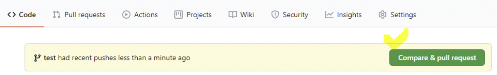
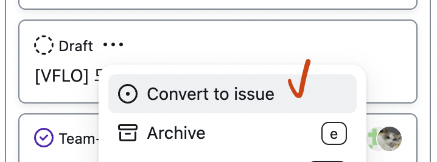

# 개발 협업 가이드

## forking-workflow

> 해당 방식을 설명한 PDF를 보려면 [여기](../pdf/forking-workflow.pdf)를 클릭해주세요.

개발 협업 방식은 forking-workflow를 따릅니다. 하나의 원격 Repository (SideTrack Organization 내부의 Repository)를 개인저장소로 Fork 한 다음에 해당 개인 리포에서 브랜치를 판 다음에 첫 커밋을 push 한 이후 원격 Repository로 Pull Request를 보내서 작업을 계속 진행합니다. 작업 과정에서 PR에서 댓글로 소통하거나 문의하여 리뷰를 진행하고, 해당 원격 담당자 및 여러 개발자의 승인을 받은 이후에 Merge 하는 방식으로 진행합니다.

> 명심해야 할 것은, 기능을 전부 작업하고 PR을 보내는 것이 아닌, **작업 처음부터** PR을 보낸 것입니다!

예를 들어, 게시판의 글 추가기능을 작업한다고 해봅시다.

1. 먼저 원격 저장소를 개인 저장소로 Fork 합니다.
2. Fork 가 완료된 상태이면 개인 저장소에서 Branch 를 생성합니다.
   ```bash
       git checkout -b feature/board-write
   ```
3. 먼저 게시판 글 추가기능을 작업하려면, 처음으로 해야하는 작업은 UI를 만드는 작업이겠지요, UI를 만들고 `ui: 게시판 글쓰기 페이지` 라는 첫 커밋을 합니다.
   > 첫 커밋은 반드시 어떤 형태로 하던 상관이 없습니다. 주석을 먼저 달고 `etc: 게시판 글쓰기 준비작업` 이라고 해서 시작하여도 무방합니다.
4. 첫 커밋한 이후 push를 하게 되면 해당 브랜치(`feature/board-write`)가 개인 Repository에서 개시되면서, 동시에 원격지의 Repository에서 "개인 저장소"의 새로운 브랜치가 생성되었다는 것이 표시됩니다. 개인저장소에도 이런 표시가 나타납니다.
   
5. 우측의 Compare & Pull Request 를 눌러 Pull Request를 생성합니다.
6. Base Repository는 원격지의 `main` 브랜치로 Head Repository는 본인 Repo의 `feature/board-write`를 지정합니다.
7. 우측 상단의 Reviewer에 **팀원 전체**를 등록합니다.
8. 아래의 Create Pull Request를 통해 PR을 게시합니다. 이때 디스코드 채팅방에 PR이 open 되었다는 알람이 울리면서 팀원들이 해당 코드를 지켜보게 됩니다. 작업된 부분에 대해서 어떤 부분이 개선되어야 하는지, 어떤 부분이 잘못되었는지, 또는 알맞은 방향성을 "PR 의 댓글"을 통해 작업자와 소통할 수 있습니다.
   > 여기서, 작업자는 어떤 부분을 리뷰해야 할지 적어주시는 것이 좋습니다. <br/> (예1) 실행 후에, 해당 기능이 잘 작동하는지의 여부를 테스트하는 것이 필요함. <br/>
   > (예2) 해당 기능을 작업하면서 성능 최적화가 더 필요한 부분이 있는지 리뷰 필요
9. 또는 작업자가 중간중간 어떤 작업을 하고 있는지를 댓글을 남김으로서, 어떤 작업을 하고 있는지 확인 할 수 있습니다.
10. 작업이 완료되고 "팀원의 과반수"가 Approve하게 되면 해당 원격지의 담당자가 Merge 하게 됩니다. 이로써 당신이 이 프로젝트에 기여하게 되었습니다!

## 작업하려는 부분을 지정할 시

저희는 Trello 등을 사용하지 않고, 오로지 Github의 자체기능을 100% 활용하고 있습니다.

Github는 각 Repository 마다 "Projects" 라는 메뉴가 있습니다. 해당 부분에서 칸반보드 형태의 TODO가 지정되어 있습니다. 맨 왼쪽의 "할일" 에 등록된 부분에서 원하시는 기능을 찾아서 해당 부분과 연결된 Issue에서 자신이 이 기능을 담당하겠다는 댓글을 남겨서 진행하시면 됩니다.

> 이슈로 연결되지 않았다면 Draft라는 뱃지가 달려있을겁니다. 해당 부분은 아래의 "Convert to an Issue"를 통해 등록해주시기 바랍니다.  
> 

반드시 해당 할일 과 작업자가 1:1 일 필요는 없습니다. 어떤 부분이든 자신이 작업하고 PR을 올리시면 됩니다.

뭔가 잘 모르겠다는 부분이 있으시면 디스코드에 질문을 올리시면 됩니다.

## 커밋컨벤션

이 [문서](./commit.md)를 참고하십시오.

## 기능 문서화

저희는 비대면 작업을 중요시하기 때문에 작업한 부분에 대해서는 문서화를 하시는 것이 좋습니다.

먼저, 주석을 잘 다는 것도 좋지만 주석만으로 설명에 한계가 있을 수 있습니다. 따라서 작업하는 모든 부분에 대해서는 해당 작업 directory의 내부에 `readme.md` 파일을 생성하여 해당 부분에 어떻게 개발하였는지, 테스트 결과는 어땠는지, 다른 개발자가 이 부분을 수정하거나 또 다른 기능을 추가하는데 고려해야 하는 사항이 무엇인지를 적어주시기 바랍니다.

**저희 사이드트랙의 프로젝트는 일정에 쫓겨서 작업해야 하는 회사 프로젝트가 아닙니다.** 사이드 프로젝트인데 스트레스를 받을 이유는 없고, 사정이 있어 잠시 개발을 중간에 멈춰야 할 수도 있습니다. 아니면 구현 방법을 잘모르는 경우가 있어서 도움이 필요 할 수 도 있습니다. 귀찮더라도 어떤 단위기능을 작업 후에는 반드시 문서화를 **수시로** 진행해 주시기 바랍니다. 그래야 다른 개발자가 이를 도와주는데 좀 더 수월해 질 수 있습니다. 문서화를 하는데에 있어서 양식은 정해진 것이 없습니다. 다만, 작업자가 누구인지, 다른 개발자가 이어서 작업시에 고려해야 하는 부분이 무엇인지는 꼭 적어주십시오.

## Pull 이 아닌 Fetch-Rebase 를 사용해주세요.

`git pull`은 `fetch`와 더불어서 `merge` 까지 동시에 이루어지는 것으로, 가급적이면 `fetch` - `rebase`를 통해 로컬 Repo를 최신화 하시기 바랍니다.

```
git fetch origin [해당 브랜치명]
git rebase FETCH_HEAD
```

이를 통해 충돌없이 리모트의 작업내용들을 불러올 수 있습니다.
