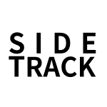

# Welcome to Team Side-Track

안녕하세요! 사이드 프로젝트를 위한 팀, **사이드트랙** 입니다!  
이 리포는 본 팀에서 진행하는 프로젝트에 대한 문서 및 협업방법을 정리하는 리포입니다!

## Side-Track 이란?

SideTrack 은 사이드 프로젝트를 하고싶은 개발자/디자이너들을 위한 팀입니다.  
여러분들의 공부와 실전 프로그래밍 경험, 시도해보고 싶은 아이디어와 그것의 구현까지 서로가 서로의 힘이 되어 함께 할 수 있는 공동체입니다.  
팀 내에서 조직을 꾸려 SideTrack 이라는 조직 이름 아래 프로젝트를 기획부터 배포까지 다른 사람들과 같이 할 수 있습니다.

## Side-Track 에서는 아래와 같은 활동이 진행중입니다.

- [VFLO](./vflo/readme.md)

## Side-Track 에서 활동 중인 분은 아래와 같습니다.

- lunaJYJ
- hjjam100
- laiel4

## Side-Track 에서 협업하는 방법에 대해서 알려드립니다.

- [개발 협업 가이드](./convention/collaboration.md)
- [커밋 컨벤션](./convention/commit.md)

## 우리 팀에 들어오시려면?

먼저, 규칙을 읽어주세요!

- [규칙](./rule.md)

어느 누구든 개발을 통해 저희 팀에서 활약하고싶은 분은 디스코드를 통해 들어오셔서 이야기 나누어 보아요!

https://discord.gg/H7ZGE8Q9kA
