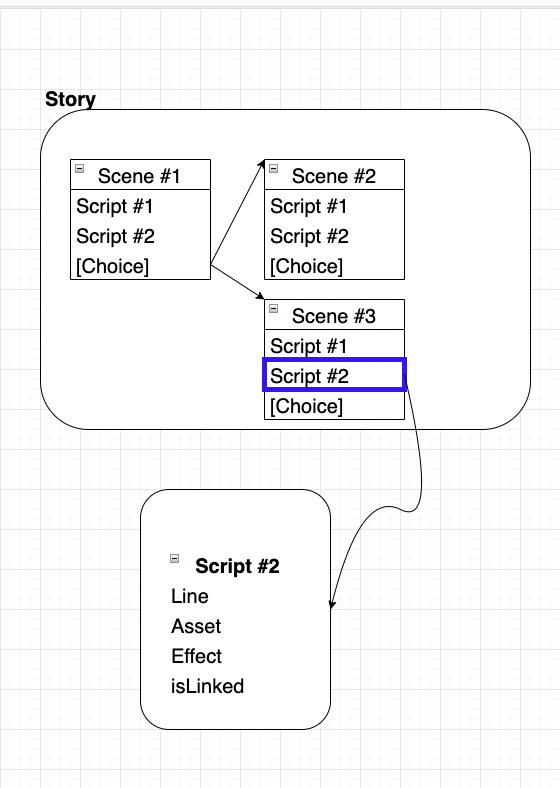

# VFLO 기획 문서

---

## 1. 반응형 옵션

- PC / Mobile 선택 옵션 제공
  - Mobile 은 PC 로 접속해도 Mobile 뷰 제공

## 2. 에디터 기본 편집 가능 요소

- 대화창 Border-top
- 대화창 Background image
- 선택창 Border (4 edge 모두)
- 선택창 Background image
- Story 기본폰트 (무로 푠트 제공)

> 대화창과 선택창 관련 이미지는 크기 미리 지정.  
> 대화창, 선택지 크기 prefix 해 둘것

## 3. Story 기본 자료 구조

- `Story` 는 `Scene`의 그래프이다.
- `Scene`은 `Script`의 집합이다.
- `Script`는 `Line`, `Asset`, `Effect`, `isLinked`의 집합이다.
- `Line` 은 `Asset`, `Effect` 를 사용하는 시점의 트리거로 사용된다.
- `Asset`은 오디오와 이미지 들을 말한다.
- `isLinked`는 다음 `Script`와 바로 연결 되어야 할 필요성이 있을 때 `true` 가 된다.
- `Choice` 는 선택지를 가리킨다. `Scene` 의 맨 처음과 끝에 존재할 수 있으며, `Scene` 의 분리 기준이 된다.
